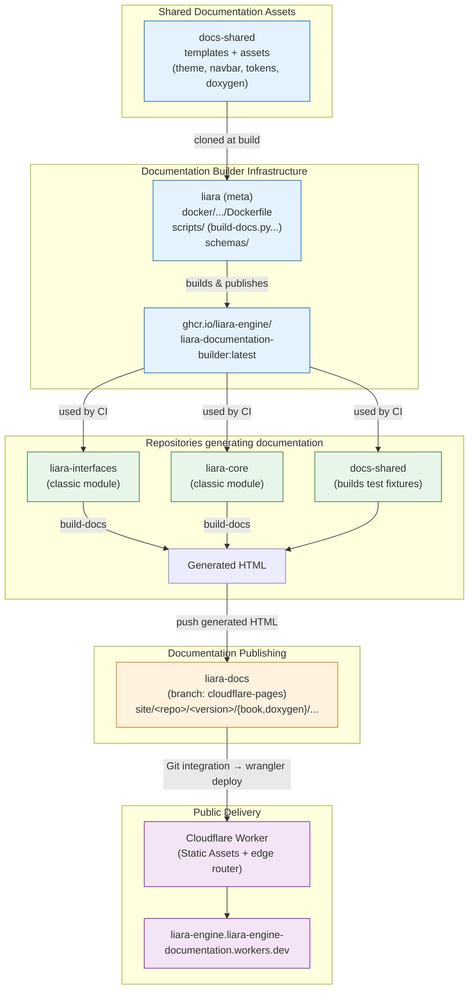

# The documentation pipeline

> The documentation of the documentation. Yes, it is a little meta.

This page explains how Liara Engine's documentation is produced, versioned, and served — every repository, tool, and moving part involved, and how they fit together.
If you are touching templates, CI, or the hosting layer, start here.

## 1. The big picture

The documentation is **not** built in one place.
Shared look-and-feel lives in one repository, the build logic lives in a container image, each module builds its own docs from its own sources, and everything is published to a single hosting repository served at the edge.



The mental model that makes everything else click: **docs-shared content is split in two.** Some of it is *baked* into the builder image and used at build time; the rest is *served at runtime* from a central `/shared-content/` path.
Knowing which is which explains the whole repository layout (see §3).

## 2. The repositories and their roles

| Repository                                         | Role                                                                                                                                                                                                                      |
|----------------------------------------------------|---------------------------------------------------------------------------------------------------------------------------------------------------------------------------------------------------------------------------|
| `docs-shared`                                      | The visual identity and templates: design tokens, navbar, the mdBook theme, the Doxygen HTML template, the central hub page. Changing how docs *look* happens here.                                                       |
| `liara` (meta)                                     | Hosts the builder: the `Dockerfile`, the build/processor `scripts/`, and the JSON `schemas/`. Changing how docs are *built* happens here.                                                                                 |
| `.github`                                          | Org-level **reusable workflows**: build, versioned deploy, PR previews, preview cleanup. Module repos call these.                                                                                                         |
| `liara-docs`                                       | The hosting repo. Generated HTML for every module and version lives on its `cloudflare-pages` branch under `site/`. Also holds the Cloudflare Worker (`wrangler.jsonc` + `src/index.js`) and the scheduled preview sweep. |
| Module repos (`liara-interfaces`, `liara-core`, …) | Each owns its own sources (`book.toml`, `docs/`, `Doxyfile`, headers, `manifest.json`) and a thin CI caller. Building a module's docs happens here.                                                                       |

## 3. Anatomy of docs-shared

```
docs-shared/
├── book.toml              # docs-shared's own developer guide (this book)
├── manifest.json          # module manifest: name, description, latest, versions
├── docs/                  # source of the guide you are reading
│
├── mdbook/theme/          # BAKED — mdBook theme override
│   ├── index.hbs          #   template that injects the navbar + theme bridge
│   ├── css/variables.css  #   maps mdBook's CSS vars onto Liara design tokens
│   └── highlight.js       #   custom Highlight.js bundle (GLSL, Dockerfile, …)
│
├── doxygen/               # BAKED — Doxygen HTML template
│   ├── header.html        #   injects <shared-navbar> + /shared-content scripts
│   └── footer.html
│
├── shared-content/        # RUNTIME — served from /shared-content/ on the site
│   ├── tokens/design-tokens.css     # single source of truth for the palette
│   ├── navbar/                      # navbar.html, .css, .js, .config.js, shared-navbar.js
│   ├── mdbook/                      # custom.css + generated shared-navbar.js + liaradoc
│   ├── doxygen/                     # doxygen-custom.css + generated shared-navbar.js + liaradoc
│   ├── hub/                         # generated shared-navbar.js + liaradoc
│   └── assets/logo.svg
│
└── hub/                   # the central landing page (deployed to the site root)
    ├── index.html
    ├── css/style.css
    ├── js/liara-hub.js
    └── 404.html           # custom not-found page (served at the site root)
```

### Baked vs runtime

* **Baked** (`mdbook/theme/`, `doxygen/`): copied into the builder image at
  image-build time. The image strips everything else from its docs-shared
  clone. These templates run during *every* module build and decide the
  structure of the generated pages. A change here only takes effect once the
  builder image is rebuilt.
* **Runtime** (`shared-content/`): never baked. It is deployed once to the
  site root at `/shared-content/`, and every generated page references it by
  absolute URL (`/shared-content/tokens/design-tokens.css`, etc.). A change
  here takes effect on the live site as soon as the shared-content is
  redeployed — no module rebuild needed.

This split is why a CSS tweak can go live without rebuilding every module, but a
template change requires a new image.

### The design system

`shared-content/tokens/design-tokens.css` is the single source of truth for
colours, typography, spacing, radii, and shadows. The mdBook theme
(`variables.css`) and the Doxygen CSS (`doxygen-custom.css`) both consume those
tokens, so the three surfaces — hub, mdBook, Doxygen — stay visually identical.
Light/dark/dyslexia modes are all driven from this one file.

### The navbar

`shared-content/navbar/` holds the shared navigation. `navbar.js` reads the
**modules registry** and each module's **manifest** at runtime to build the
per-module dropdowns and version selectors; `navbar.config.js` tells it where
the docs are hosted (`docsBaseUrl`) and where the registry lives. The
`<shared-navbar>` web component is registered per context by the generated
`shared-navbar.js` files (mdBook / Doxygen / hub), produced from a single
template via the `{{{MODULE}}}` replacement.

### The liaradoc resource/replacement system

Files named `*.liaradoc.json` declare, per context, which static **resources**
to copy into the output and which **replacements** to perform in the generated
HTML (for example `{{{LOGO}}}`, `{{{MODULE}}}`, or `<DOCS_SHARED_BASE>`). The
builder's processor (see §4) reads these and rewrites the pages accordingly.
They conform to the `documentation-module.schema.json` schema.

## 4. The builder image

`ghcr.io/liara-engine/liara-documentation-builder` is an ultra-light Debian
image that bakes in:

* **Doxygen** and **mdBook** binaries,
* the docs-shared **baked templates** (`/opt/docs-shared`),
* the build scripts: `build-docs` plus the `processor.py` family,
* `ajv` for JSON-schema validation.

It expects the module's sources mounted at `/src` and writes generated HTML to
`/docs`. `build-docs` runs roughly:

1. **Validate** `manifest.json` (required) and any `*.liaradoc.json` against
   their schemas; fail fast on error.
2. **Stage shared assets**: copy `/opt/docs-shared/*` into `/src/docs-shared/`
   so the mdBook theme path (`docs-shared/mdbook/theme`) and the Doxygen header
   resolve locally.
3. **Process** resources and replacements (`processor.py`): copy declared
   resources, substitute placeholders in the HTML.
4. **Doxygen**: if a `Doxyfile` exists, run it (output forced to
   `/src/build/doxygen`), then copy the HTML to `/docs/doxygen`.
5. **mdBook**: if a `book.toml` exists, auto-generate `SUMMARY.md` when missing
   (from `README.md` + the other pages), then build to `/docs/book`.
6. **Extra**: copy any `ADDITIONAL_DIRECTORIES_TO_OUTPUT` through verbatim.

The image version pins a specific docs-shared tag (`DOCS_SHARED_VERSION`), so
the baked templates are reproducible. Bumping templates means bumping that tag
and rebuilding.

## 5. Authoring a module's docs

A module repository provides:

* `manifest.json` — required. Declares `metadata.name`, `metadata.description`,
  `metadata.latest`, and a `versions` map with ABI compatibility. `latest`
  drives the `/<repo>/latest/` redirect (see §7).
* `book.toml` + `docs/` — optional mdBook guide. `theme = "docs-shared/mdbook/theme"`.
  If there is no `SUMMARY.md`, one is generated from `README.md` first, then the
  remaining pages.
* `Doxyfile` + headers — optional API reference. `HTML_HEADER`/`HTML_FOOTER`
  point at `docs-shared/doxygen/`.
* `*.liaradoc.json` — optional per-module resources and replacements.

In practice every module has a book; some also have a Doxygen reference. The
worker's fallback (§7) tolerates a module that has only one of the two.

## 6. Building and publishing

CI lives as **reusable workflows** in `.github`, called by a thin caller in each
module repo:

* **Build** runs the builder image against the checkout and uploads the
  generated `docs` and `manifest` as artifacts.
* **Deploy** checks out `liara-docs`, places the build under
  `site/<repo>/<version>/`, copies `manifest.json` to the canonical
  `site/<repo>/manifest.json`, and pushes to the `cloudflare-pages` branch.
  Old versions are left in place, so previous docs stay reachable.

### Versioning

* `dev` tracks the development branch; `x.y.z` are releases.
* Each version is a directory under `site/<repo>/`, so nothing is overwritten
  on release — `/<repo>/1.0.0/` and `/<repo>/dev/` coexist.
* `manifest.metadata.latest` records the newest version; the hub's
  `version.json` and the `modules-registry.json` (both at the site root) drive
  the navbar's version selector and module list.

## 7. Hosting

`liara-docs` is deployed via Cloudflare's Git integration as a **Workers Static
Assets** project. The `site/`
directory is served directly; a small Worker (`src/index.js`) runs only when no
static asset matches a request. The Worker handles three things:

* **`latest`** — `/<repo>/latest/…` reads `metadata.latest` from the module's
  manifest and 302-redirects to the concrete version. `/<repo>` alone resolves
  to latest too. These redirects are `no-cache` because latest moves.
* **View fallback** — `/<repo>/<version>/` with no view 301/302-redirects to
  `book/` if it exists, else `doxygen/`.
* **Custom 404** — anything unresolved is served `/404.html` with a 404 status.

### URL surface (quick reference)

| URL                                                                | Result                               |
|--------------------------------------------------------------------|--------------------------------------|
| `/`                                                                | The hub landing page                 |
| `/<repo>/<version>/book/…`                                         | mdBook page (static)                 |
| `/<repo>/<version>/doxygen/…`                                      | Doxygen page (static)                |
| `/<repo>/<version>/`                                               | → `book/` (or `doxygen/`)            |
| `/<repo>/latest/…`                                                 | → resolved version from the manifest |
| `/<repo>` or `/<repo>/`                                            | → latest → `book/`                   |
| `/<repo>/pr-<n>/…`                                                 | A PR preview (see §8)                |
| `/shared-content/…`                                                | Runtime shared assets                |
| `/modules-registry.json`, `/version.json`, `/<repo>/manifest.json` | Metadata consumed by the navbar      |
| anything else                                                      | The custom 404 page                  |

## 8. PR previews

To test changes before merging, each PR can publish a throwaway build to a
hidden path, reachable only by direct URL (the navbar never lists it).

* **Classic modules** publish to `site/<repo>/pr-<n>/`, built by the same
  toolchain as a real version but **without** touching the canonical
  `manifest.json`. Triggered automatically when documentation files change
  (path filter), or on demand via the `docs-preview` label. The preview URL is
  posted as a sticky comment on the PR.
* **docs-shared** is special: a PR there changes the templates and shared assets
  everyone uses, so its preview builds the **test fixtures** (`tests/fixtures/`)
  with *the PR's* versions of both — the baked templates are mounted over
  `/opt/docs-shared`, and the PR's `shared-content/` is bundled into the preview
  with `/shared-content/` references re-pointed at it. Output lands at
  `site/docs-shared/pr-<n>/`.

Cleanup: previews are removed when the PR closes, and a daily **sweep** prunes
anything whose PR is closed or has been idle for more than 30 days.

These previews are the supported way to validate documentation changes — there
is intentionally no separate local-only path, because reproducing the full
toolchain locally is more error-prone than running the real thing on a hidden
URL.

## 9. Where to change what

| You want to change…          | Edit…                                       | Takes effect after…                    |
|------------------------------|---------------------------------------------|----------------------------------------|
| Colours, typography, spacing | `docs-shared/shared-content/tokens/`        | shared-content redeploy                |
| Navbar behaviour or markup   | `docs-shared/shared-content/navbar/`        | shared-content redeploy                |
| mdBook page structure        | `docs-shared/mdbook/theme/`                 | builder image rebuild + module rebuild |
| Doxygen page structure       | `docs-shared/doxygen/`                      | builder image rebuild + module rebuild |
| Build steps / processors     | `liara/scripts/` + `Dockerfile`             | builder image rebuild                  |
| Validation rules             | `liara/schemas/`                            | next build                             |
| Redirects, 404, hosting      | `liara-docs/src/index.js`, `wrangler.jsonc` | `wrangler deploy` (Git push)           |
| CI behaviour                 | `.github` reusable workflows                | next workflow run                      |