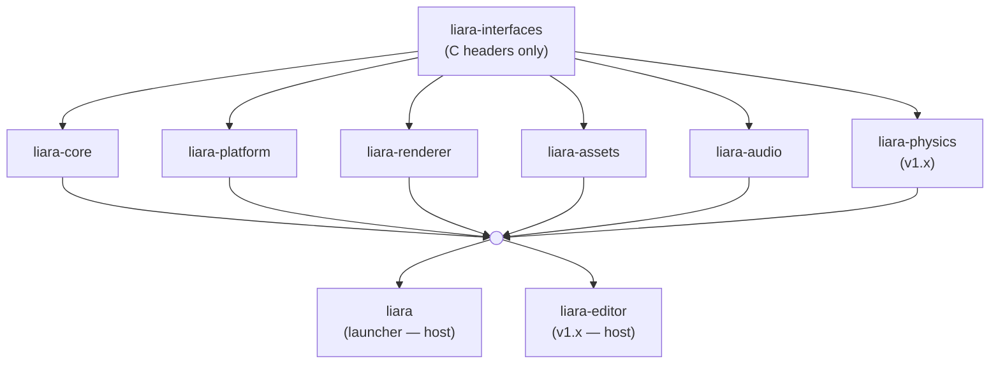

# Modules

> Concrete decomposition of the Liara Engine project into repositories, modules, and the boundaries between them. This document is the companion to [`ARCHITECTURE.md`](ARCHITECTURE.md): where `ARCHITECTURE.md` explains the philosophy of modularity, this document specifies what is actually built and where it lives.

---

## Table of Contents

- [1. Repository Map](#1-repository-map)
  - [1.1 The contract](#11-the-contract)
  - [1.2 The modules](#12-the-modules)
  - [1.3 The hosts](#13-the-hosts)
  - [1.4 The infrastructure](#14-the-infrastructure)
  - [1.5 The rule that defines a module](#15-the-rule-that-defines-a-module)
  - [1.6 Introduction schedule](#16-introduction-schedule)
- [2. The Meta Repository: `liara`](#2-the-meta-repository-liara)
  - [2.1 Purpose](#21-purpose)
  - [2.2 Contents](#22-contents)
  - [2.3 What It Does Not Contain](#23-what-it-does-not-contain)
  - [2.4 Versioning Policy](#24-versioning-policy)
- [3. The Interface Repository: `liara-interfaces`](#3-the-interface-repository-liara-interfaces)
  - [3.1 Purpose](#31-purpose)
  - [3.2 Contents](#32-contents)
  - [3.3 What It Does Not Contain](#33-what-it-does-not-contain)
  - [3.4 Versioning Policy](#34-versioning-policy)
- [4. The Core Repository: `liara-core`](#4-the-core-repository-liara-core)
  - [4.1 Purpose](#41-purpose)
  - [4.2 Contents](#42-contents)
  - [4.3 What It Does Not Contain](#43-what-it-does-not-contain)
  - [4.4 Internal Organization](#44-internal-organization)
- [5. The Platform Repository: `liara-platform`](#5-the-platform-repository-liara-platform)
  - [5.1 Purpose](#51-purpose)
  - [5.2 Contents](#52-contents)
  - [5.3 What It Does Not Contain](#53-what-it-does-not-contain)
  - [5.4 Shutdown requests are poll-only](#54-shutdown-requests-are-poll-only)
  - [5.5 Replaceability](#55-replaceability)
- [6. The Assets Repository: `liara-assets`](#6-the-assets-repository-liara-assets)
  - [6.1 Purpose](#61-purpose)
  - [6.2 Contents](#62-contents)
  - [6.3 What It Does Not Contain](#63-what-it-does-not-contain)
  - [6.4 The boundary that is easiest to get wrong](#64-the-boundary-that-is-easiest-to-get-wrong)
- [7. The Audio Repository: `liara-audio`](#7-the-audio-repository-liara-audio)
  - [7.1 Purpose](#71-purpose)
  - [7.2 Contents](#72-contents)
  - [7.3 What It Does Not Contain](#73-what-it-does-not-contain)
- [8. The Renderer Repository: `liara-renderer`](#8-the-renderer-repository-liara-renderer)
  - [8.1 Purpose](#81-purpose)
  - [8.2 Contents](#82-contents)
  - [8.3 What It Does Not Contain](#83-what-it-does-not-contain)
  - [8.4 Internal Organization](#84-internal-organization)
- [9. The Editor Repository: `liara-editor`](#9-the-editor-repository-liara-editor)
  - [9.1 Purpose](#91-purpose)
  - [9.2 Status in v0.x](#92-status-in-v0x)
  - [9.3 Contents (Anticipated)](#93-contents-anticipated)
- [10. The Physics Repository: `liara-physics`](#10-the-physics-repository-liara-physics)
  - [10.1 Status in v0.x](#101-status-in-v0x)
  - [10.2 Contents (Anticipated)](#102-contents-anticipated)
- [11. Auxiliary Repositories](#11-auxiliary-repositories)
  - [11.1 `docs-shared`](#111-docs-shared)
  - [11.2 `liara-docs`](#112-liara-docs)
  - [11.3 `.github` (Organization-Level)](#113-github-organization-level)
- [12. Dependency Graph](#12-dependency-graph)
- [13. Module Boundaries: What Crosses, What Doesn't](#13-module-boundaries-what-crosses-what-doesnt)
  - [13.1 Core → Renderer (per frame)](#131-core--renderer-per-frame)
  - [13.2 Renderer lifecycle (host-driven)](#132-renderer-lifecycle-host-driven)
  - [13.3 Resource upload (host-mediated)](#133-resource-upload-host-mediated)
  - [13.4 Renderer → host (callbacks)](#134-renderer--host-callbacks)
  - [13.5 Core → Editor (post-v1.0)](#135-core--editor-post-v1)
  - [13.6 Editor → Renderer (post-v1.0)](#136-editor--renderer-post-v1)
  - [13.7 Platform → Host (per frame)](#137-platform--host-per-frame)
  - [13.8 Host → Platform (at startup)](#138-host--platform-at-startup)
  - [13.9 Assets → host → renderer / audio](#139-assets--host--renderer--audio)
  - [13.10 Core → host → audio (per frame)](#1310-core--host--audio-per-frame)
- [14. Where Things Live: A Cross-Reference](#14-where-things-live-a-cross-reference)
- [15. Adding a New Module](#15-adding-a-new-module)
- [16. Removing or Renaming a Module](#16-removing-or-renaming-a-module)

---

## 1. Repository Map

The project is composed of the following repositories, all hosted under the `liara-engine` GitHub organization. They fall into four kinds, and the kind matters more than the list.

### 1.1 The contract

| Repository         | Role                                                  | Status  |
|--------------------|-------------------------------------------------------|---------|
| `liara-interfaces` | The C ABI headers every module implements or consumes | Phase 0 |

The contract is not a module: it contains no implementation and exports no symbol. Everything else in the project either implements a part of it or consumes it.

### 1.2 The modules

A module implements one namespace of the contract, is versioned on its own cadence, and is replaceable in principle by an alternative implementation — including one written in another language.

| Repository       | ABI namespace      | Role                                                 | Introduced |
|------------------|--------------------|------------------------------------------------------|------------|
| `liara-core`     | `liara_core_*`     | ECS, math, logger, settings, events, loop primitives | Phase 0    |
| `liara-platform` | `liara_platform_*` | Window, input devices, OS signals, timing            | v0.1       |
| `liara-renderer` | `liara_renderer_*` | Reference Vulkan renderer                            | Phase 0    |
| `liara-assets`   | `liara_assets_*`   | Loading, decoding and lifetime of asset data         | v0.3       |
| `liara-audio`    | `liara_audio_*`    | Audio playback and mixing                            | v0.5       |
| `liara-physics`  | `liara_physics_*`  | Rigid bodies, collision, queries                     | v1.x       |

`liara-core` is the one module that is not replaceable: it owns the data model everything else agrees on. It is a module rather than a privileged runtime because it obeys the same rules — one ABI namespace, one `info()` entry point, its own version — and because a subsystem that cannot be described through the contract does not belong in it.

### 1.3 The hosts

A host composes modules: it creates them, checks their ABI versions against each other, owns the application loop, and moves data between them. A host is not a module — it exports nothing and nobody links against it.

| Repository     | Role                                                                   | Introduced |
|----------------|------------------------------------------------------------------------|------------|
| `liara` (meta) | The launcher, plus everything that must know about all modules at once | Phase 0    |
| `liara-editor` | The editor application                                                 | v1.x       |

### 1.4 The infrastructure

Consumed by CI and by the documentation pipeline, never by CMake.

| Repository    | Role                                                       | Status  |
|---------------|------------------------------------------------------------|---------|
| `.github`     | Org-level reusable workflows, shared CI scripts, templates | Phase 0 |
| `docs-shared` | Design system, documentation templates, builder image      | Phase 0 |
| `liara-docs`  | Generated documentation hosting and edge worker            | Phase 0 |

### 1.5 The rule that defines a module

One module is one ABI namespace, and the three spellings never diverge:

- one include namespace — `liara/<name>/`
- one symbol prefix — `liara_<name>_*`
- one self-description entry point — `liara_<name>_info()`

A subsystem gets its own namespace from its first line of code, before anyone knows whether it will ever move into its own repository. Moving an implementation between repositories is cheap; renaming a symbol that consumers already call is a MAJOR bump of `liara-interfaces` and breaks every one of them. The repository layout is a delivery decision and is revisable; the namespace is a contract and is not.

### 1.6 Introduction schedule

A repository is created when its first line of code is written, not before. `liara-platform` therefore appears with v0.1, `liara-assets` with v0.3, `liara-audio` with v0.5, `liara-physics` and `liara-editor` with v1.x. Until then they exist in this document and nowhere else.

---

## 2. The Meta Repository: `liara`

The `liara` repository is the public face of the project and the orchestrator of everything else. It does not contain engine code; it contains the things that need to know about all modules at once.

### 2.1 Purpose

The meta repository serves four functions. It is the **landing page** for the project on GitHub: the README that a visitor reads first, the issue tracker that catches general questions, the discussions board for project-wide topics. It is the **launcher and distribution** point: the small executable that composes the modules and owns the application loop, the AUR `PKGBUILD`, the Windows installer or portable archive script. It is the **workspace orchestrator**: the bootstrap script that clones and configures all other repositories for local development. And it is the **compatibility matrix**: the authoritative record of which versions of which modules work together.

### 2.2 Contents

The repository contains, at minimum:

- A top-level README with project description, build status badges, and links to documentation.
- This entire `docs/` directory: the foundational documents (`ARCHITECTURE.md`, `MODULES.md`, `ROADMAP.md`, etc.) and the ADRs.
- A `launcher/` source directory containing the small standalone application that initializes the core and runs the standalone game loop. This is the executable that ships in the AUR package.
- A `scripts/` directory containing the workspace bootstrap script, release coordination scripts, and any other tooling that operates across repositories.
- A `packaging/` directory containing the Linux `PKGBUILD`, the Windows packaging script, and any other distribution artifacts [in 0.6].
- A `schemas/` directory containing JSON schemas for any file formats defined at the meta level.
- A `docker/` directory containing any Dockerfiles (and associated scripts) used for development or CI.

### 2.3 What It Does Not Contain

The meta repository does not contain engine logic, rendering code, ECS implementation, or any other functionality that belongs in a module. It also does not contain documentation generated from source code (Doxygen output) — that documentation is generated by each module's and published in the `liara-docs` repository.

### 2.4 Versioning Policy

The meta repository's versioning follows the engine's milestone roadmap. Module repositories version independently, on their own cadence.

---

## 3. The Interface Repository: `liara-interfaces`

The `liara-interfaces` repository is the most version-sensitive piece of the project. Every other module declares which version of `liara-interfaces` it requires, and a breaking change to interfaces ripples through every consumer.

### 3.1 Purpose

This repository defines the C ABI contracts between modules. Nothing in the project may communicate across a module boundary without going through a header defined here. Modules that internally use richer C++ types must wrap them at their public surface to expose only the C interface.

### 3.2 Contents

The repository contains exclusively C headers, organized by module.

A possible layout of the headers is (the real layout may differ):

```
include/liara/
├── version.h           # Version macros and ABI version negotiation
├── types.h             # Common POD types (vec3, mat4, handles, etc.)
├── result.h            # Error reporting convention
├── allocator.h         # Memory allocator interface (caller-supplied)
├── core/
│   ├── module.h        # Generic module lifecycle (init, shutdown, version)
│   ├── world.h         # ECS-side opaque handles (entity, world)
│   └── events.h        # Input and lifecycle events
├── renderer/
│   ├── renderer.h      # Renderer module entry point and lifecycle
│   ├── render_target.h # Abstract render target type
│   ├── view.h          # View / camera structures
│   ├── packet.h        # Render packet structures
│   └── debug.h         # Debug primitive submission
├── physics/            # (post-v1.0)
└── scripting/          # (post-v1.0)
```

In addition to headers, the repository contains:

- A `CMakeLists.txt` exposing the headers as an `INTERFACE` library that consumers link against to gain include paths.
- A `vcpkg.json` declaring no runtime dependencies, with a `tests` feature pulling in doctest.
- Tests that verify each header compiles standalone and is C-callable, compiled with both a C and a C++ compiler in CI, plus cross-language tests that consume the headers from Zig and Rust. The cross-language tests are registered only when the corresponding toolchain is present.
- The `INTERFACES.md` document specifying the rules for designing, evolving, and versioning interfaces.

### 3.3 What It Does Not Contain

No implementation. No `.c` or `.cpp` files (other than the test files, which are minimal and verify properties of the headers themselves). No external dependencies (the headers may use only fixed-width integer types from `<stdint.h>` and `<stddef.h>`).

### 3.4 Versioning Policy

This repository follows **strict semantic versioning**, with the rules spelled out in `INTERFACES.md`. The headline:

- **MAJOR** version bumps for any change that breaks ABI or source compatibility for consumers.
- **MINOR** version bumps for purely additive changes that do not affect existing consumers.
- **PATCH** version bumps for documentation, comments, or whitespace.

The version is encoded in `version.h` as preprocessor macros and is checked at module load time via the function each module exports to report its interface version.

---

## 4. The Core Repository: `liara-core`

The core is the foundation that every other module depends on. It owns the data and the schedule; modules transform data on a schedule the core dictates.

### 4.1 Purpose

The core implements everything that is shared, mandatory, and not replaceable. It is the answer to "what is always there, no matter what modules are loaded?".

### 4.2 Contents

The core repository implements:

**The ECS.** Entity allocation with generational handles, sparse-set component storage, world container, query API, system scheduling. This is hand-written from scratch (see [Architecture.md](ARCHITECTURE.md#entity-component-system-model) for the rationale).

**The math layer.** Vector, matrix, and quaternion types as plain C structs (defined in `liara-interfaces`), with implementation functions that operate on them. Internal computation may use a vendored copy of GLM where convenient, but no GLM type ever crosses the module boundary.

**The logger.** A multi-threaded logging system with structured log entries, multiple sinks (stdout, file, in-memory ring buffer for the ImGui console), and runtime log level control. The architecture follows what was prototyped in the previous engine, simplified.

**The settings system.** Type-safe key-value storage with serialization to TOML, runtime change notifications, and category-based organization. This carries forward the design from the previous engine, with the file format changed from custom to TOML.

**The event system.** Internal pub-sub for engine events (entity created, component added, asset loaded, etc.) and external input events (keyboard, mouse, gamepad, window). Decoupled from rendering: input events flow through the core and may be consumed by scripting, editor, or game logic, not just by the renderer.

**The application loop primitives.** The `liara_core_step(dt)` function that advances the simulation by one tick, along with the helper functions that the launcher (or the editor, in editor mode) uses to build a complete loop.

**Module lifecycle primitives.** The core exposes, through the C interface, the entry points a host needs to drive it: creation, destruction, and the per-tick step. It does not load, register, or hold references to other modules. Composition — deciding which renderer (or other module) to pair with the core, checking their interface versions against each other, and wiring them together — is the host's responsibility (the launcher today, the editor post-v1.0). The core is handed whatever it needs through its interface; it never reaches for a sibling module by name. The version-negotiation logic the host uses at composition time is the seed for what becomes a runtime dynamic loader if the project moves to DSO modules — but that loader lives in the host, not in the core.

### 4.3 What It Does Not Contain

No rendering. No window, no input device, no OS signal handling — those are `liara-platform`. No file loading or decoding — that is `liara-assets`. No audio device or mixing — that is `liara-audio`. No editor code, no gameplay code, no tools.

The core does not open a file, does not talk to a device, and does not call an OS API beyond threading and time. That is the practical test for whether something belongs here: if it needs the outside world, it is not core.

### 4.4 Internal Organization

The core's internal directory layout follows the categories above.

A possible layout is (the real layout may differ):

```
src/
├── ecs/
├── math/
├── logger/
├── settings/
├── events/
└── loop/
```

This layout is internal to the core and may evolve. It is not part of any contract.

---

## 5. The Platform Repository: `liara-platform`

### 5.1 Purpose

Everything the engine needs from the operating system, behind one interface. The platform module is what makes "Linux and Windows are both first-class" a property of one repository rather than a `#ifdef` scattered across all of them.

### 5.2 Contents

**Window management.** Window creation, resizing, fullscreen, and exposure of the native handle that the renderer needs to create its surface. SDL3 is the backend; no SDL type ever crosses the module boundary.

**Input devices.** Keyboard, mouse, gamepad. The module reports physical device state and physical events; it does not know what an action is. Mapping physical inputs to logical actions is a consumer's concern.

**OS signals and shutdown requests.** SIGINT, SIGTERM and Windows console control events, plus the window's close button. These are deliberately the same thing at the interface: they are all "the user asked the process to stop", and a host that handles one handles all of them.

**Timing.** Monotonic clock and high-resolution counters, so that the loop's notion of time does not depend on which standard library the host was built against.

### 5.3 What It Does Not Contain

No ECS, no rendering, no audio device (that is `liara-audio`, even though both talk to the OS — the boundary is the concern, not the fact of being OS-specific). No file I/O beyond resolving standard paths; reading files is `liara-assets`. No logical input mapping.

### 5.4 Shutdown requests are poll-only

The interface exposes shutdown as a flag the host polls, never as a callback:

```c
liara_result_t liara_platform_install_signal_handlers(liara_platform_handle_t*);
bool           liara_platform_quit_requested(const liara_platform_handle_t*);
```

Three constraints follow, and all three are easy to violate later:

- **No function pointer crosses the boundary for this.** A callback invoked from a POSIX signal handler would be async-signal-unsafe, and a callback in a struct is the anti-pattern of [INTERFACES.md](https://liara-engine.liara-engine-documentation.workers.dev/liara-interfaces/latest/book/INTERFACES#anti-patterns-to-avoid). The handler does the only thing it is allowed to do — write a flag — and the loop reads it.
- **Signal handlers are process-global, not per-instance.** `liara_platform_install_signal_handlers` is documented as idempotent and installed at most once per process, whatever the number of platform handles.
- **It works without a window.** Installing the handlers does not require the windowing backend to be initialized, so a headless tool — a test harness, a future asset cooker — can use the module for shutdown handling alone.

### 5.5 Replaceability

Replaceable. A platform module built on GLFW, on winit, or directly on Wayland and Win32 is a legitimate substitute, and the SDL3 dependency is confined here precisely so that this remains true.

---

## 6. The Assets Repository: `liara-assets`

### 6.1 Purpose

Turning bytes on disk into data the engine can use, and owning that data's lifetime. It is the only module that reads the file system.

### 6.2 Contents

**Loading and decoding.** glTF 2.0 for models, common image formats through stb_image for textures, SPIR-V for shaders, common audio formats for sounds. Each loader produces a plain description plus a CPU-side buffer.

**Handle allocation and lifetime.** Every asset is referenced by a stable opaque handle. Consumers keep handles, never pointers into asset storage. This is what makes hot-reload buildable later without touching any consumer: the handle survives, the bytes behind it are replaced.

**The residency model.** What is loaded, what is resident, what can be evicted, and what is reference-counted by whom.

### 6.3 What It Does Not Contain

No GPU upload — the renderer does that, given CPU-side data and a handle. No playback — `liara-audio` does that, given decoded PCM. No asset *pipeline* (offline compilation, packaging, optimization): raw loading only in v0.x, per `ARCHITECTURE.md`. No ECS: an asset is not an entity.

### 6.4 The boundary that is easiest to get wrong

`liara-assets` decodes; it does not consume. It hands a mesh's vertex data to whoever asks and never learns that the renderer uploaded it; it hands decoded PCM to whoever asks and never learns that the audio module played it. Every transfer is mediated by the host, exactly as the render packet is. The moment the assets module calls into the renderer, the module boundary is gone.

---

## 7. The Audio Repository: `liara-audio`

### 7.1 Purpose

Playing sound. Audio is the clearest replaceability case in the project: the gap between a hobby project's needs and a shipped game's needs is filled, in practice, by swapping the audio backend for FMOD or Wwise. The engine's job is to make that a module swap and not a rewrite.

### 7.2 Contents

**Device and mixing.** Device selection, the mixing graph, voice allocation and lifetime. miniaudio is the backend; no miniaudio type crosses the boundary.

**Playback.** Playing a decoded sound, looping, stopping, volume, and basic bus routing. Spatialization is deferred per `ARCHITECTURE.md`; v0.x is 2D audio.

### 7.3 What It Does Not Contain

No decoding: the module is handed PCM by the host, which got it from `liara-assets`. No file access. No ECS: an emitter component lives in the core, and the host turns it into playback calls, in exactly the way it turns renderable components into a render packet.

---

## 8. The Renderer Repository: `liara-renderer`

The renderer is the reference implementation of the renderer interface. It is the most complex module and the one whose replaceability matters most.

### 8.1 Purpose

The renderer takes render packets produced by the core and produces pixels. It manages the GPU, the swapchain, render targets, pipelines, and shaders. It does not know about the ECS, about gameplay, or about the editor; it only knows about the data the core hands it each frame.

### 8.2 Contents

The renderer repository implements:

**The Vulkan device layer.** Instance creation, physical device selection, logical device creation, queue management, command pool management. Built on `Vulkan-Hpp` and `VMA`.

**The swapchain manager.** Surface creation, from the native window handle the host obtained from `liara-platform` and passed in at initialization, swapchain creation, recreation on resize, image acquisition, and presentation.

**The render target abstraction.** Both swapchain-backed targets and offscreen-texture-backed targets, exposed through the same opaque handle to consumers. Image transitions, format negotiation, and allocation strategy are encapsulated here.

**The pipeline cache.** Shader module loading, pipeline state description, pipeline creation, caching of pipelines keyed by their state. SPIR-V is consumed; the renderer does not compile GLSL itself (that is done at build time by `glslc` invoked from CMake).

**The render passes.** The actual frame logic: receiving a render packet, sorting by material/pipeline, issuing draw calls, handling transparency, presenting to the swapchain.

**The debug rendering subsystem.** Lines, wireframes, AABBs, frustums, and other primitives submitted by the core (or, post-v1.0, by the editor for gizmos). Implemented as a separate pass with its own simple pipeline.

**The ImGui integration.** ImGui is rendered by the renderer because it is fundamentally a rendering operation. The integration is designed so that the editor (post-v1.0) submits its UI through the editor interface, and the renderer draws it. In v0.x, ImGui is used only for the developer console and stats overlays.

### 8.3 What It Does Not Contain

No ECS code. No gameplay logic. No window creation — the window belongs to `liara-platform`, and the renderer receives only a native handle from the host. No asset loading from disk (the renderer receives prepared asset data from the core's asset manager). No input handling.

### 8.4 Internal Organization

A possible layout of the renderer's internal source tree is (the real layout may differ):

```
src/
├── device/
├── swapchain/
├── targets/
├── pipelines/
├── passes/
├── debug/
├── imgui/
└── platform/
shaders/
```

The `shaders/` directory contains GLSL source for the engine's built-in shaders, compiled to SPIR-V at build time and either embedded in the binary or shipped alongside it (controlled by a CMake option).

---

## 9. The Editor Repository: `liara-editor`

The editor is the in-engine authoring tool that, post-v1.0, allows scenes to be built without writing code. It is **not introduced until the v1.x cycle**; the repository is created when the first editor code is written.

### 9.1 Purpose

The editor is the application a developer launches to build a game. It hosts the engine, lets the developer place entities in the scene visually, edit their components through an inspector, and save and load scenes. It is the analog of the Unity Editor or the Unreal Editor.

### 9.2 Status in v0.x

The editor does not exist in v0.x. Scenes are constructed in code or loaded from JSON files written by hand. This is acknowledged as a limitation; it is not a permanent state of affairs. The interfaces in v0.x are designed so that introducing the editor in v1.x does not require interface changes — see [Architecture.md Render Targets](ARCHITECTURE.md#render-targets-and-multi-view-rendering) and [Architecture.md Forward-Looking Decisions](ARCHITECTURE.md#forward-looking-decisions) for the specific design choices that enable this.

### 9.3 Contents (Anticipated)

When the editor is built, the repository will contain:

- An application that owns its own window and swapchain, embeds the engine as a library, and drives the engine's tick manually.
- An ImGui-based UI: scene hierarchy, component inspector, asset browser, scene viewport (rendering the scene to a texture and displaying it in an ImGui panel), play/pause/step controls.
- Gizmo rendering for entity manipulation, integrated with the renderer's debug rendering subsystem.
- Scene serialization (load/save scenes as JSON or a custom format).
- Project management (create new project, set up directory structure, manage assets).

---

## 10. The Physics Repository: `liara-physics`

The physics module provides collision detection and rigid body dynamics. It is **not introduced until the v1.x cycle**.

### 10.1 Status in v0.x

Physics does not exist in v0.x. Entities have transforms, but nothing moves except by direct ECS manipulation. This is acknowledged as a limitation.

When the physics module is introduced, its design will be informed by experience using the engine to build a game without it. The interface for physics is **not** designed in v0.x precisely because that design would be premature.

### 10.2 Contents (Anticipated)

When introduced, the physics module will likely include:

- A choice of integration: a custom implementation, or a wrapper around Bullet, PhysX, or Jolt. This decision is deferred until the milestone.
- Collision shapes (box, sphere, capsule, mesh, heightfield).
- Rigid body dynamics with constraints and joints.
- Raycasts and queries.
- Debug visualization integrated with the renderer's debug rendering subsystem.

---

## 11. Auxiliary Repositories

### 11.1 `docs-shared`

The visual identity and the templates shared by every documentation site in the project. Its content is split in two:

- **Baked** — `mdbook/theme/` (the mdBook theme override, including the `index.hbs` that injects the navbar) and `doxygen/` (the Doxygen `header.html` / `footer.html`). These are copied into the documentation builder image at image-build time, pinned to a tag. Changing them requires rebuilding the image and then rebuilding each module's docs.
- **Runtime** — `shared-content/`: the design tokens (`tokens/design-tokens.css`, the single source of truth for the palette, typography and the light/dark/dyslexia modes), the navbar (`navbar/`), the per-context stylesheets and generated `shared-navbar.js` files, and `assets/`. This is deployed once to the site root at `/shared-content/` and referenced by absolute URL from every generated page, so a CSS change goes live without rebuilding anything.

The repository also contains `hub/`, the project's landing page and custom 404, deployed to the site root, and `tests/fixtures/`, a synthetic module used to preview template changes in CI.

The full mechanism is described in [DOCUMENTATION_PIPELINE.md](DOCUMENTATION_PIPELINE.md).

### 11.2 `liara-docs`

The repository that hosts the project's generated documentation. It contains no authored prose: everything under `site/` on its `cloudflare-pages` branch is produced by the documentation builder from the other repositories' sources, one directory per module and per version. It also holds the Cloudflare Worker that resolves `latest`, falls back between views and serves the custom 404, and the scheduled sweep that prunes stale pull request previews.

### 11.3 `.github` (Organization-Level)

A special repository that GitHub recognizes as the source of organization-wide defaults. It contains:

- `profile/README.md` — the organization's public landing page.
- `ISSUE_TEMPLATE/` — bug report, feature request, documentation, question.
- `PULL_REQUEST_TEMPLATE.md` — the default pull request template.
- `.github/workflows/reusable-*.yml` — the reusable workflows every other repository invokes: build and quality, the ABI pipeline, documentation build/deploy/preview, commitlint, manifest validation, container image generation and pruning.
- `scripts/` — the helpers those workflows call, which are not trivial enough to inline in YAML. A workflow that needs one of them checks this repository out at the ref the caller pinned.

Each module's CI consumes the reusable workflows from this repository, so that updates to CI logic happen in one place. This is the same discipline as `docs-shared`, applied to CI.

---

## 12. Dependency Graph

The static dependency graph between repositories is:



Reading the graph:

- `liara-interfaces` depends on nothing.
- **Every module depends on `liara-interfaces` and on nothing else.** No module depends on another module — not even on the core. They are siblings.
- Hosts depend on the modules they compose.

The infrastructure repositories (`.github`, `docs-shared`, `liara-docs`) do not appear: they are consumed by GitHub Actions, not by CMake.

---

## 13. Module Boundaries: What Crosses, What Doesn't

This section enumerates the data flows that cross module boundaries. Anything not listed here should not cross.

### 13.1 Core → Renderer (per frame)

The core sends the renderer a render packet describing what to draw this frame. The packet contains, at minimum:

- A list of views, each with a camera, viewport, and target.
- A list of drawables per view, each with a transform, mesh handle, and material handle.
- A list of lights affecting the scene.
- A list of debug primitives to draw this frame.
- A list of UI draw commands (ImGui draw data, in v0.x).

This data is plain-old-data and does not retain ownership: once the renderer has consumed the packet, it may discard it.

### 13.2 Renderer lifecycle (host-driven)

The host creates and destroys the renderer, and the core, independently, through their respective C interfaces. At startup the host supplies the renderer with the native window handle and GPU configuration; at shutdown it requests the renderer to flush and release resources. The core never creates, owns, or directly calls the renderer.

### 13.3 Resource upload (host-mediated)

When the core loads an asset, it exposes the CPU-side data and a stable handle through its interface. The host passes that data to the renderer for GPU upload and associates the handle with the resulting GPU resource. Subsequent render packets reference the asset by handle. The data path is core → host → renderer; there is no direct core → renderer call.

### 13.4 Renderer → host (callbacks)

The renderer reports events — surface lost, swapchain resized, GPU error — through callbacks the host registers at renderer init. The host decides how to propagate these to the core.

### 13.5 Core → Editor (post-v1)

The editor reads ECS state to populate the scene hierarchy and inspector. The interface for this is **read-mostly**: the editor can inspect any entity but mutates entities only through specific edit commands that the core executes (so that undo/redo is possible).

### 13.6 Editor → Renderer (post-v1)

The editor submits gizmo geometry through the debug rendering interface, on top of the scene render. The editor also requests render targets for its scene viewport panels.

### 13.7 Platform → host (per frame)

The platform module reports, on demand: the physical input events accumulated since the last poll, the window's current size and state, whether a shutdown has been requested (close button or OS signal — see [The Platform Repository](#the-platform-repository-liara-platform)), and the monotonic time. All of it is plain data, valid until the next poll.

The host decides what to do with it: which events to forward to the core's event bus, how to map physical inputs to logical actions, and whether a shutdown request is honoured immediately or deferred. The platform module never terminates the process itself.

### 13.8 Host → platform (at startup)

The host creates the window and asks for its native handle, which it then passes to the renderer at initialization. This is the one piece of data that travels from one module to another, and it travels through the host, as an opaque pointer or a fixed-width integer whose interpretation is documented.

### 13.9 Assets → host → renderer / audio

When the host loads an asset, it receives a stable handle and, on request, the CPU-side data behind it. It hands mesh and texture data to the renderer for GPU upload, and decoded PCM to the audio module for playback. Neither consumer retains a pointer into asset storage: they keep the handle, and the data is theirs to copy or upload during the call.

That constraint is what makes asset hot-reload implementable later without touching a single consumer.

 ### 13.10 Core → host → audio (per frame)

The core produces, alongside the render packet, the list of audio events for this tick — start, stop, parameter change, each referencing an asset handle. The host submits it to the audio module. It is the render packet pattern applied to sound, and for the same reasons: plain data, no retained ownership, no coupling between the simulation and the backend.

---

## 14. Where Things Live: A Cross-Reference

For specific topics, the canonical location is:

| Topic                               | Repository             |
|-------------------------------------|------------------------|
| ECS implementation                  | `liara-core`           |
| Math implementation                 | `liara-core`           |
| Logger                              | `liara-core`           |
| Settings (TOML)                     | `liara-core`           |
| Event bus                           | `liara-core`           |
| Window creation                     | `liara-platform`       |
| Input devices                       | `liara-platform`       |
| OS signals / shutdown request       | `liara-platform`       |
| Asset loading and decoding          | `liara-assets`         |
| Asset handles and lifetime          | `liara-assets`         |
| Audio playback and mixing           | `liara-audio`          |
| GPU upload                          | `liara-renderer`       |
| Vulkan device                       | `liara-renderer`       |
| ImGui setup                         | `liara-renderer`       |
| Debug primitives drawing            | `liara-renderer`       |
| All handle and POD types in the API | `liara-interfaces`     |
| Render packet structure             | `liara-interfaces`     |
| Render packet construction          | `liara-core`           |
| Render packet consumption           | `liara-renderer`       |
| Logical input mapping               | `liara` (launcher)     |
| Standalone game loop                | `liara` (launcher)     |
| Compatibility matrix                | `liara`                |
| AUR PKGBUILD                        | `liara`                |
| ADRs                                | `liara` (`docs/adr/`)  |
| Design system, navbar, templates    | `docs-shared`          |
| Documentation hub landing page      | `docs-shared` (`hub/`) |
| Shared CI workflows and scripts     | `.github`              |
| Documentation hosting + worker      | `liara-docs`           |

When a topic is added to the project, this table is updated.

---

## 15. Adding a New Module

The process for introducing a new module to the project is:

1. **Claim the namespace first.** Before any code: pick `<name>`, and use `liara/<name>/` and `liara_<name>_*` from the first line, even while the implementation still lives inside an existing repository. This step is free now and irreversible later.

2. **Justify the module.** A subsystem earns its own namespace when it has a boundary expressible as a C interface *and* at least one of: it is not always needed (a headless tool can do without it), it is a plausible replacement target, or it drags in an external dependency that nothing else needs. A subsystem that fails all three belongs inside an existing module.

3. **Design the interface.** Add headers to `liara-interfaces`. This is the expensive step and the one that must not be rushed; it is also the reason a module's interface is designed when its first real implementation is written, not years ahead.

4. **Bump `liara-interfaces`.** A new namespace is additive: MINOR.

5. **Create the repository** — and not before this point. Copy the standard scaffolding, register it in the workspace orchestrator's module list, in the documentation registry, and in the compatibility matrix.

6. **Update this document**, the dependency graph, and the cross-reference table.

Splitting an existing module follows steps 1 to 3 only, then moves files. That is the whole point of step 1: if the namespace was claimed early, the split is a repository move and consumers recompile unchanged.

---

## 16. Removing or Renaming a Module

Modules are not removed or renamed lightly. When a module's responsibilities shrink to nothing, or when its name becomes misleading, the change is treated as a major version event for the meta repository. The old repository is archived (not deleted), the new repository is created, and the migration path is documented in an ADR.

This conservatism reflects the reality that external links to repositories accumulate over time and that breaking them is a real cost, even for a project at this scale.

---

[Back to top](#modules)
