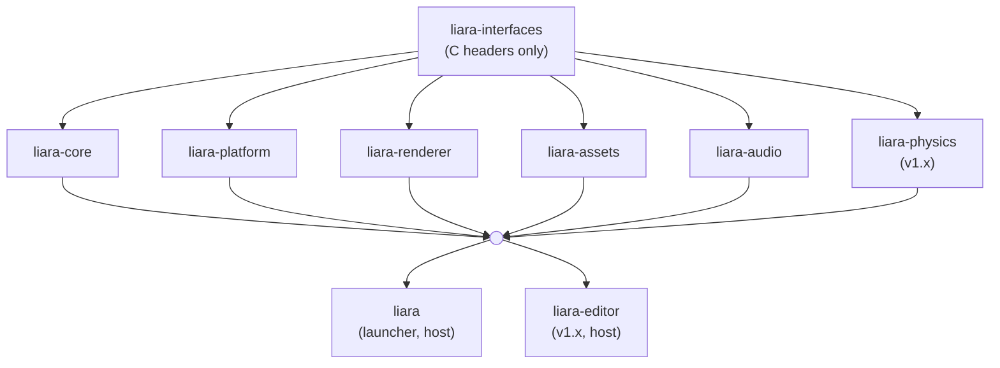

## The dependency graph

`liara-interfaces` depends on nothing. Every module depends on it and on nothing else, not even on the core, because they are siblings. Hosts depend on the modules they compose, and they are the only thing in the project allowed to know the shape of that set.

The infrastructure repositories do not appear at all, since `.github`, `docs-shared` and `liara-docs` are consumed by GitHub Actions rather than by CMake.

## Every frame

**Core to renderer.** The core produces a render packet describing what to draw: a list of views, each with a camera, a viewport and a target; a list of drawables per view, each with a transform, a mesh handle and a material handle; the lights affecting the scene; the debug primitives for this frame; and the UI draw commands, which in v0.x means ImGui's draw data. It is all plain data and it retains no ownership, so once the renderer has consumed a packet it may discard it.

**Core to host to audio.** Alongside the render packet, the core produces this tick's audio events: start, stop, parameter change, each referencing an asset handle. The host submits them to the audio module. It is the render packet pattern applied to sound, for the same reasons: plain data, no retained ownership, no coupling between the simulation and the backend.

**Platform to host.** On demand, the platform module reports the physical input events accumulated since the last poll, the window's current size and state, whether a shutdown has been requested (the close button and an OS signal being the same thing here, as [`liara-platform`](../platform/) explains), and the monotonic time. All plain data, valid until the next poll.

The host decides what to do with that: which events to forward to the core's event bus, how to map a physical input to a logical action, and whether a shutdown request is honoured immediately or deferred. The platform module never terminates the process itself.

## At startup and shutdown

**Host to platform.** The host creates the window and asks for its native handle, which it then passes to the renderer at initialisation. That handle is the one piece of data travelling from one module to another, and it travels through the host, as an opaque pointer or a fixed-width integer whose interpretation is documented.

**Renderer lifecycle.** The host creates and destroys the renderer and the core independently, through their own C interfaces. At startup it supplies the renderer with that native handle and the GPU configuration, and at shutdown it asks the renderer to flush and release. The core never creates, owns or calls the renderer.

## On demand

**Assets to host to renderer, or to audio.** The host asks `liara-assets` to load something and receives a stable handle plus, on request, the CPU-side data behind it. It hands mesh and texture data to the renderer for GPU upload, and decoded PCM to the audio module for playback. Later render packets reference the asset by handle.

Neither consumer retains a pointer into asset storage. They keep the handle, and the data is theirs to copy or upload during the call. That single constraint is what makes hot-reload implementable later without touching one consumer: the handle survives and the bytes behind it are replaced.

**Renderer to host.** The renderer reports surface loss, swapchain resize and GPU errors through callbacks the host registers at initialisation. The host decides how to propagate them to the core.

## After v1.0

**Core to editor.** The editor reads ECS state to populate the scene hierarchy and the inspector. The interface is read-mostly: the editor may inspect any entity and mutates one only through edit commands the core executes, which is what makes undo and redo possible at all.

**Editor to renderer.** The editor submits gizmo geometry through the debug rendering interface, drawn on top of the scene, and requests render targets for its viewport panels. Both already exist for other reasons, which is the point of designing them now.
